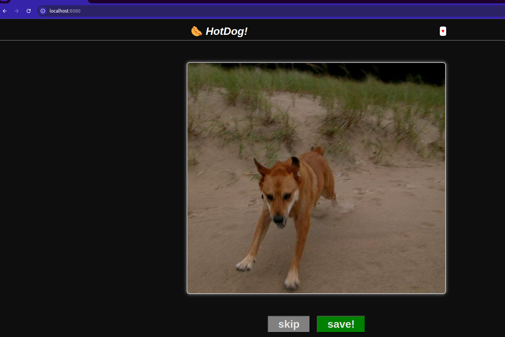

# Dioxus PoC

This tutorial explores the basic concepts of the Dioxus framework using version `0.6.3`. You can find all dependencies and theoretical background at the official source: 

- https://dioxuslabs.com/learn/0.6/guide/#

With the `fullstack` feature enabled, this setup runs a backend that serves both the frontend (Web) and an API accessible via RPC calls.

The app is written in Rust and compiled to WebAssembly (WASM).

## Serving The App

```bash
dx serve --platform web
```

## App

<h2 align="center">

</h2>

